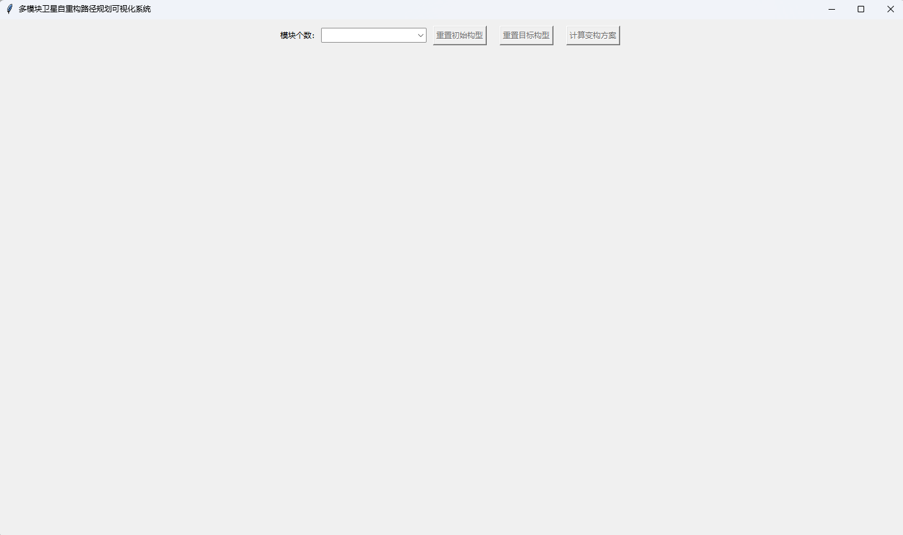
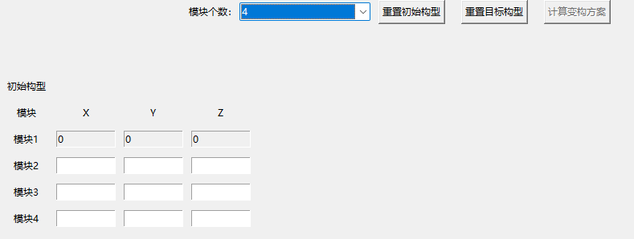
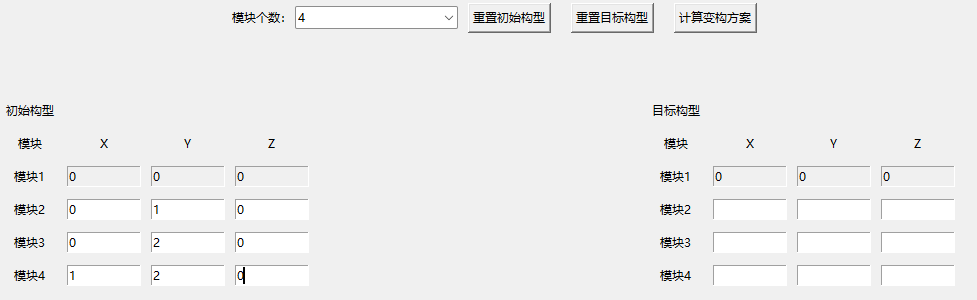
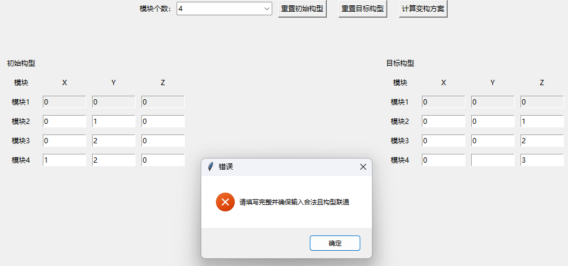
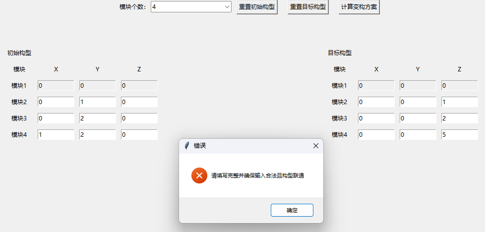
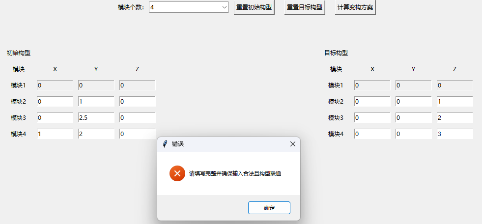
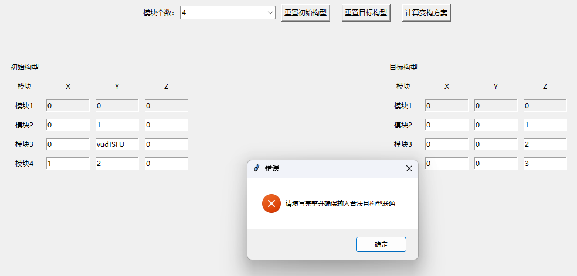
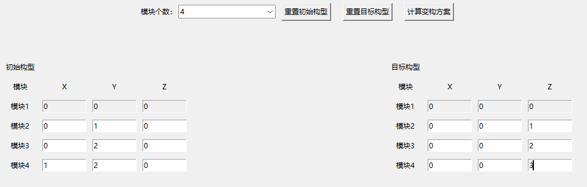
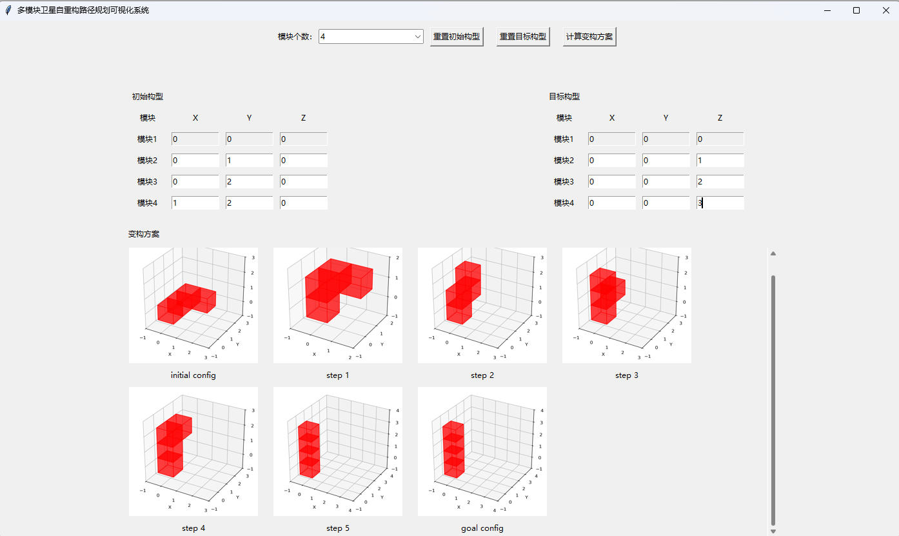

# 多模块卫星自重构路径规划可视化系统
本项目为基于论文["A Goal-Oriented Reinforcement Learning-Based Path Planning Algorithm for Modular Self-Reconfigurable Satellites"](https://arxiv.org/abs/2505.01966)实现的多模块卫星自重构路径可视化软件。包含预训练模型、算法实现以及图形化操作界面(GUI)。

## 一、环境依赖与预训练模型配置
**在使用本项目前，请在根目录下新建两个空文件夹，分别命名为"model"与"app_plot"。**

### 环境依赖
```bash
conda create -n sat python=3.9
conda activate sat
git clone https://github.com/perfactliu/ModuSatVis.git
cd ModuSatVis
pip install -r requirements.txt
```

### 预训练模型
从[Google Drive](https://drive.google.com/drive/folders/1BEaaR3Lnek-0xkoX-hGmv-avGyU0FabS?usp=drive_link)下载预训练模型，放入"\model"文件夹中。\
当然，你也可以训练并使用自己的模型，但需要注意**命名规范**。

## 二、软件使用说明
在命令行运行下面命令以启动程序。
```bash
cd ModuSatVis
python main.py
```

### 系统登录与取消
通过选择用户的身份进行登录，同时输入密码，点击登录按钮进行登录。用户名与密码可以在"\gui\app.py"文件中修改。\
对于不需要进行登录的情况单击取消按钮进行登录退出操作。

<div align="center">
  
</div>

### 系统主界面
当系统成功登录以后，将会进入到主页面，如下图所示。

<div align="center">
  
</div>

页面布局分为菜单栏和输入显示栏上下两个部分，未进行路径计算时仅有菜单栏显示。

### 菜单栏
菜单栏有四个选项，分别是模块个数、重置初始构型、重置目标构型以及计算变构方案。

<div align="center">
  
</div>

#### 模块个数选项
当前版本软件的模块个数为选项式填入，支持计算四个模块和六个模块的变构方案计算。选择后重置初始构型和重置目标构型按钮变为可用状态。

<div align="center">
  
</div>

#### 重置初始构型

点击重置初始构型按钮后出现模块个数行的可填入坐标，如下图所示，坐标仅支持整数数据，并且要求构型联通。模块1为默认模块，其坐标始终为（0,0,0），为只读状态。

<div align="center">
  
</div>

#### 重置目标构型

点击重置目标构型按钮后出现模块个数行的可填入坐标，如下图所示，坐标仅支持整数数据，并且要求构型联通。模块1为默认模块，其坐标始终为（0,0,0），为只读状态。

<div align="center">
  
</div>

初始构型与目标构型的填入均有数据安全性检查，任何非法的填入都是不被允许的。例如：

（1）有空格没有被填入：

<div align="center">
  
</div>

（2）构型不能联通：

<div align="center">
  
</div>

（3）输入数值非法，不为整数：

<div align="center">
  
</div>

<div align="center">
  
</div>

#### 计算变构方案

当用户如下图所示填入完整且正确的卫星初始构型与目标构型后再点击计算变构方案时将不会报错。

<div align="center">
  
</div>

之后，用户点击计算变构方案按钮开始计算变构方案。最终用户会得到计算好的变构方案的可视化图像如下所示：

<div align="center">
  
</div>

图像展示了卫星集群的初始构型、目标构型以及变构过程。其中第一张图（initial config）表示用户输入的初始构型图。step（1-5）分别表示了模型每一步计算得到的方案结果，最后一张图（goal config）表示了用户输入的目标构型。用户通过对比最后一步的变构结果图（本示例为step5）与目标构型图（goal config）是否相同，可以判断本次模型计算的路径规划方案是否成功。

### 退出登录

用户点击右上角的关闭按钮（X）退出软件的使用。下一次重启软件时，会自动进入登录界面。

## 三、关于可执行程序生成

本项目支持通过pyinstaller将程序打包为可执行程序，首先确保设备安装了pyinstaller。

```bash
pip install pyinstaller
```

运行下面命令将本项目打包为可执行程序(.exe)文件。

```bash
cd ModuSatVis
pyinstaller ^
  --name SatConfig ^
  --noconsole ^
  --icon=fig\main.ico ^
  --add-data "fig;fig" ^
  --add-data "model;model" ^
  --add-data "app_plot;app_plot" ^
  --add-data "environments;environments" ^
  main.py
```

